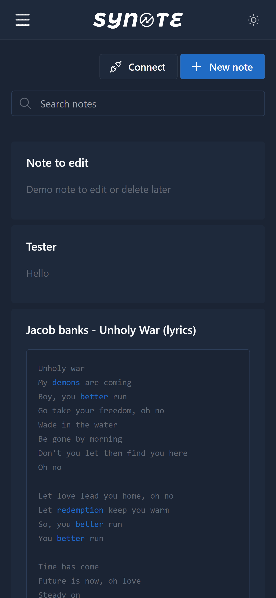
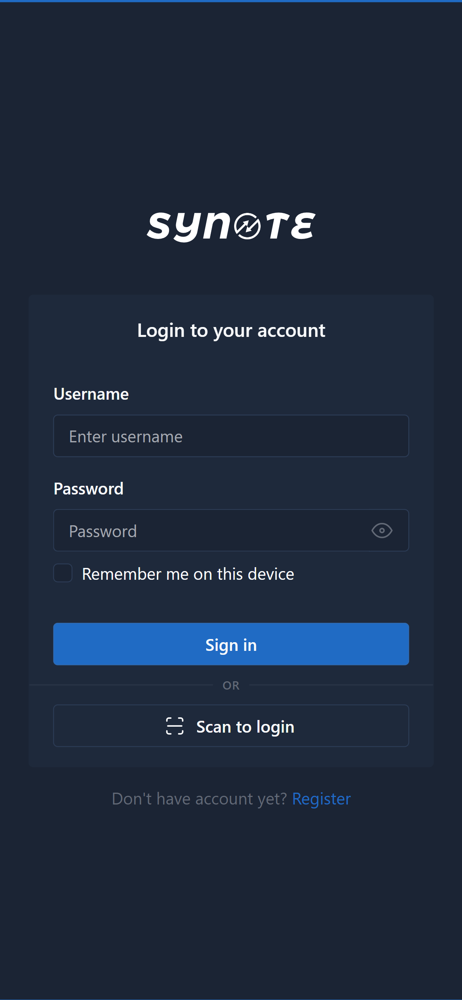

<div id="top"></div>

<!-- PROJECT SHIELDS -->
<!--
*** I'm using markdown "reference style" links for readability.
*** Reference links are enclosed in brackets [ ] instead of parentheses ( ).
*** See the bottom of this document for the declaration of the reference variables
*** for contributors-url, forks-url, etc. This is an optional, concise syntax you may use.
*** https://www.markdownguide.org/basic-syntax/#reference-style-links
-->
[![Contributors][contributors-shield]][contributors-url]
[![Forks][forks-shield]][forks-url]
[![Stargazers][stars-shield]][stars-url]
[![Issues][issues-shield]][issues-url]
[![MIT License][license-shield]][license-url]
[![LinkedIn][linkedin-shield]][linkedin-url]


<!-- PROJECT LOGO -->
<br />
<div align="center">
  <a href="https://github.com/michael-arawole/synote">
    
  </a>

  <h3 align="center">synote</h3>

  <p align="center">
    <a href="https://demo.logad.net/synote">View Demo</a>
    ·
    <a href="https://github.com/michael-arawole/synote/issues">Report Bug</a>
    ·
    <a href="https://github.com/michael-arawole/synote/issues">Request Feature</a>
  </p>
</div>


<!-- ABOUT THE PROJECT -->
## About The Project
Features
* Login / Signup
* Connect device / Scan to login (Like WhatsApp web)
* Add Note
* Edit Note
* Delete Note
* Context Menu on right click / long press (for mobile)
* Card Masonry
* TinyMCE editor

Demo Login :
* Username : mikethedev
* Password : test

Looking to create different versions of this

The projects includes the Postman API documentation

* [Postman Documentation](https://documenter.getpostman.com/view/10657913/UzXUPtsJ)
<p align="right">(<a href="#top">back to top</a>)</p>

## Screenshot
<p align="left">


</p>

### Built With
* [PHP](https://php.net/)
* [Bootstrap](https://getbootstrap.com)
* [JQuery](https://jquery.com)

<p align="right">(<a href="#top">back to top</a>)</p>


### Installation

_How to install._

1. Navigate to backend/inc/config.php
2. Edit the credentials
   ```php
   $dbHost = "<DATABASE-HOST>";
   $dbUser = "<DATABASE-USERNAME>";
   $dbPass = "<DATABASE-PASSWORD>";
   $dbName = "<DATABASE-NAME>";
   ```
   
3. Upload synote.sql to your database
4. Save and open the url in your browser

<p align="right">(<a href="#top">back to top</a>)</p>

<!-- CONTRIBUTING -->
## Contributing

Contributions are what make the open source community such an amazing place to learn, inspire, and create. Any contributions you make are **greatly appreciated**.

If you have a suggestion that would make this better, please fork the repo and create a pull request. You can also simply open an issue with the tag "enhancement".
Don't forget to give the project a star! Thanks again!

1. Fork the Project
2. Create your Feature Branch
3. Commit your Changes
4. Push to the Branch
5. Open a Pull Request

<p align="right">(<a href="#top">back to top</a>)</p>


<!-- LICENSE -->
## License

Distributed under the MIT License.

<p align="right">(<a href="#top">back to top</a>)</p>


<!-- CONTACT -->
## Contact
Michael Arawole - [@MichaelArawole](https://twitter.com/michaelarawole) - michael@logad.net

<p align="right">(<a href="#top">back to top</a>)</p>


<!-- ACKNOWLEDGMENTS -->
## Acknowledgments

Special thanks to these guys for their amazing tool

* [Tabler Icons](https://tabler-icons.io)
* [Tabler Dashboard Template](https://github.com/tabler/tabler)
* [Masonry](https://masonry.desandro.com)
* [Toastr](https://github.com/CodeSeven/toastr)
* [Google Charts](https://developers.google.com/chart/infographics/docs/qr_codes)
* [Qr Scanner](https://github.com/nimiq/qr-scanner)
<p align="right">(<a href="#top">back to top</a>)</p>

<!-- MARKDOWN LINKS & IMAGES -->
<!-- https://www.markdownguide.org/basic-syntax/#reference-style-links -->
[contributors-shield]: https://img.shields.io/github/contributors/michael-arawole/synote.svg?style=for-the-badge&1
[contributors-url]: https://github.com/michael-arawole/synote/graphs/contributors
[forks-shield]: https://img.shields.io/github/forks/michael-arawole/synote.svg?style=for-the-badge&1
[forks-url]: https://github.com/michael-arawole/synote/network/members
[stars-shield]: https://img.shields.io/github/stars/michael-arawole/synote.svg?style=for-the-badge&1
[stars-url]: https://github.com/michael-arawole/synote/stargazers
[issues-shield]: https://img.shields.io/github/issues/michael-arawole/synote.svg?style=for-the-badge&1
[issues-url]: https://github.com/michael-arawole/synote/issues
[license-shield]: https://img.shields.io/github/license/michael-arawole/synote.svg?style=for-the-badge&1
[license-url]: https://github.com/michael-arawole/synote/blob/master/LICENSE.txt
[linkedin-shield]: https://img.shields.io/badge/-LinkedIn-black.svg?style=for-the-badge&logo=linkedin&colorB=555
[linkedin-url]: https://linkedin.com/in/michaelarawole/
[product-screenshot]: screenshots/login.png
